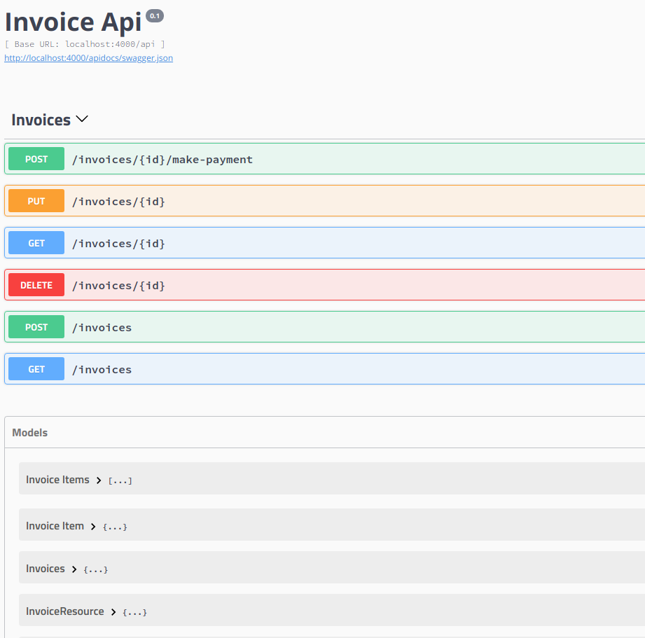

# Invoice

### Setup

- Configure MongoDB

```
# with auth = false
use admin
db.createUser({ user: "mongodb" , pwd: "mongodb", roles: [{role: "userAdminAnyDatabase", db: "admin"}]})

# enable auth = true
# finally create db and db user
use invoice_dev
db.createUser({ user: "invoice" , pwd: "invoice", roles: ["readWrite", "dbAdmin"]})
```

### API Documentation

- Access the API documentation at http://localhost:4000/apidocs
- If you change swagger definition, run `mix phx.swagger.generate` to regenerate swagger.json definition



### Test and Coverage

```
mix coveralls.html
```

To start your Phoenix server:

  * Install dependencies with `mix deps.get`
  * Start Phoenix endpoint with `mix phx.server`

Now you can visit [`localhost:4000`](http://localhost:4000) from your browser.

Ready to run in production? Please [check our deployment guides](http://www.phoenixframework.org/docs/deployment).

## Learn more

  * Official website: http://www.phoenixframework.org/
  * Guides: http://phoenixframework.org/docs/overview
  * Docs: https://hexdocs.pm/phoenix
  * Mailing list: http://groups.google.com/group/phoenix-talk
  * Source: https://github.com/phoenixframework/phoenix
